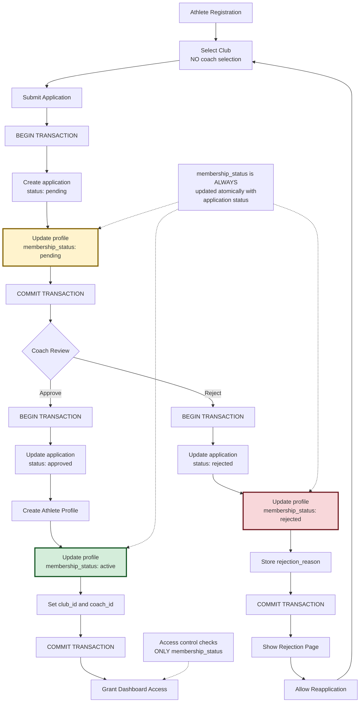
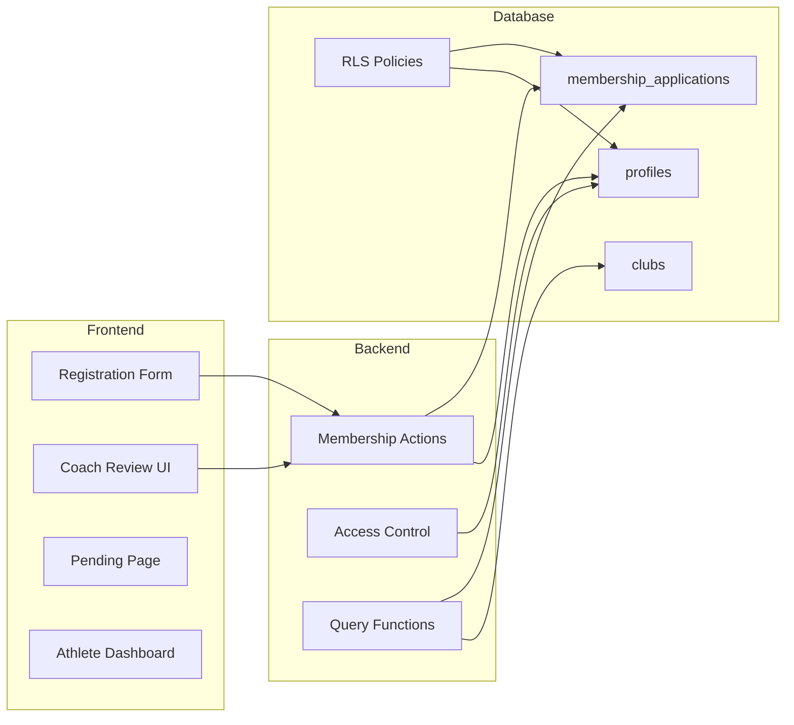
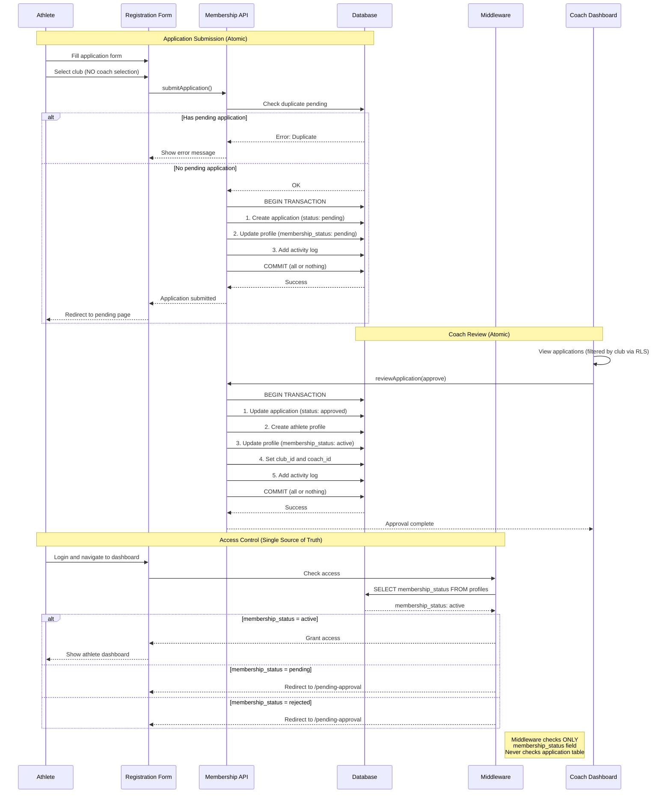
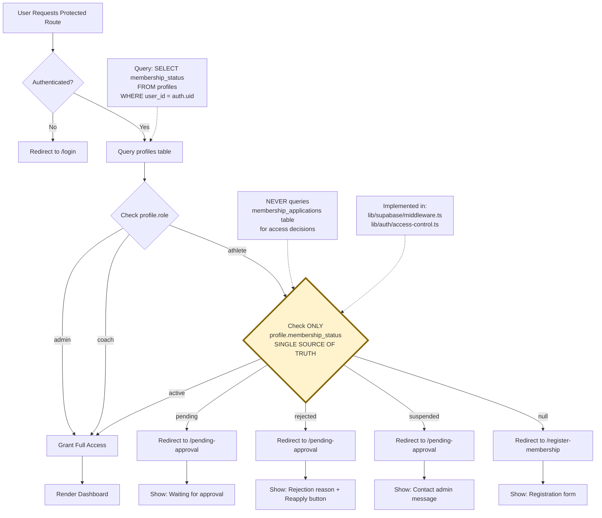
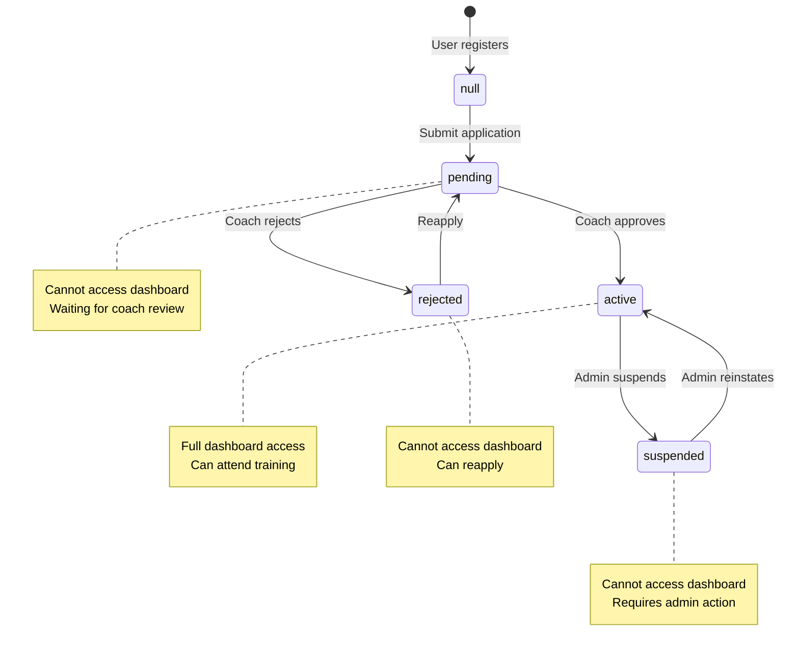

# Membership Approval System Documentation

## Overview

The Membership Approval System is a comprehensive workflow that manages athlete registration and coach approval for sports clubs. Athletes apply to join a club, coaches review and approve/reject applications, and the system controls access based on membership status.

## System Architecture

### High-Level Flow

**CRITICAL: Single Source of Truth**
The `profiles.membership_status` field is the **single source of truth** for all access control decisions. All middleware and access control functions check ONLY this field, never the application status.



### Component Architecture



## Approval Flow Diagram

### Athlete Application Flow

**Key Points:**
- `membership_status` is updated atomically with application status in a single transaction
- Access control checks ONLY `membership_status`, never application status
- All state transitions are atomic - either all succeed or all fail
- Database triggers ensure consistency between application and profile status



### Coach Review Flow

**State Transitions:**
- All status updates are atomic (wrapped in database transactions)
- `membership_status` is ALWAYS updated in the same transaction as application status
- Profile creation happens within the same transaction as approval
- If any step fails, entire transaction is rolled back

```mermaid
stateDiagram-v2
    [*] --> ViewApplications: Coach logs in
    ViewApplications --> ReviewDetails: Click application
    ReviewDetails --> CheckClub: RLS Policy Check
    CheckClub --> CanReview: application.club_id = coach.club_id
    CheckClub --> Deny: Different club (RLS blocks query)
    
    CanReview --> Approve: Click approve
    CanReview --> Reject: Click reject (reason required)
    
    state Approve {
        [*] --> BeginTx: BEGIN TRANSACTION
        BeginTx --> UpdateApp: application.status = approved
        UpdateApp --> UpdateReviewer: Set reviewed_by and reviewed_at
        UpdateReviewer --> CreateProfile: Create athlete profile
        CreateProfile --> UpdateMembership: profile.membership_status = active
        UpdateMembership --> SetClubCoach: Set profile.club_id and coach_id
        SetClubCoach --> ActivityLog: Add activity log entry
        ActivityLog --> CommitTx: COMMIT
        CommitTx --> [*]: All changes persisted
    }
    
    state Reject {
        [*] --> BeginTx2: BEGIN TRANSACTION
        BeginTx2 --> ValidateReason: Check rejection_reason provided
        ValidateReason --> UpdateApp2: application.status = rejected
        UpdateApp2 --> StoreReason: Store rejection_reason
        StoreReason --> UpdateReviewer2: Set reviewed_by and reviewed_at
        UpdateReviewer2 --> UpdateMembership2: profile.membership_status = rejected
        UpdateMembership2 --> ActivityLog2: Add activity log entry
        ActivityLog2 --> CommitTx2: COMMIT
        CommitTx2 --> [*]: All changes persisted
    }
    
    Approve --> Success: Athlete can access dashboard
    Reject --> Rejected: Athlete can reapply
    Deny --> [*]: No access (RLS enforced)
    
    note right of Approve: ATOMIC: All updates in<br/>single transaction<br/>membership_status = active<br/>enables dashboard access
    note right of Reject: ATOMIC: All updates in<br/>single transaction<br/>membership_status = rejected<br/>allows reapplication
```

### Access Control Flow

**CRITICAL: Single Source of Truth**
- Access control is based ONLY on `profiles.membership_status`
- Application status is NEVER checked for access decisions
- Middleware enforces this consistently across all routes
- Both middleware.ts and access-control.ts use identical logic



## Single Source of Truth: membership_status

### Core Principle

The `profiles.membership_status` field is the **single source of truth** for all access control decisions in the system. This design principle ensures consistency and prevents data synchronization issues.

### Why This Matters

**Before (Problematic):**
- Access control checked multiple fields (application status, profile fields, etc.)
- Data could become inconsistent (approved application but pending profile)
- Middleware and access control functions used different logic
- Athletes could access dashboard before approval or after rejection

**After (Current Implementation):**
- Access control checks ONLY `profiles.membership_status`
- All status updates are atomic (wrapped in transactions)
- Middleware and access control functions use the same logic
- Impossible to have inconsistent states

### State Transitions

The membership_status field follows a strict state machine with well-defined transitions:



**Valid Transitions:**
- `null` → `pending` (on application submission)
- `pending` → `active` (on coach approval)
- `pending` → `rejected` (on coach rejection)
- `active` → `suspended` (admin action only)
- `suspended` → `active` (admin reinstatement)
- `rejected` → `pending` (on reapplication)

**Invalid Transitions (prevented by application logic):**
- `active` → `pending` (cannot unapprove - would break data integrity)
- `rejected` → `active` (must go through pending for proper review)
- `suspended` → `pending` (requires admin to reinstate to active)
- `null` → `active` (must go through application process)

**Transition Rules:**
1. All transitions must update both `membership_applications.status` and `profiles.membership_status` atomically
2. Transitions must occur within a database transaction
3. Activity log must be updated with each transition
4. Rejection transitions require a `rejection_reason`
5. Approval transitions require creating an athlete profile

### Implementation Details

**Middleware (`lib/supabase/middleware.ts`):**
```typescript
// Check membership_status ONLY - never checks application table
const { data: profile } = await supabase
  .from('profiles')
  .select('membership_status, role')
  .eq('user_id', user.id)
  .single();

// Access decision based ONLY on membership_status
if (profile.role === 'athlete' && profile.membership_status !== 'active') {
  return NextResponse.redirect('/pending-approval');
}
```

**Access Control (`lib/auth/access-control.ts`):**
```typescript
// Single source of truth check - consistent with middleware
export async function getAthleteAccessStatus() {
  const profile = await getProfile(user.id);
  
  return {
    hasAccess: profile.membership_status === 'active',
    status: profile.membership_status,
    // ... other fields
  };
}
```

**Application Submission (`lib/membership/actions.ts`):**
```typescript
// Atomic update - both tables updated in single transaction
const { error } = await supabase.rpc('begin');

try {
  // 1. Create application
  await supabase.from('membership_applications').insert({
    user_id: userId,
    club_id: clubId,
    status: 'pending',
    personal_info: data.personal_info
  });
  
  // 2. Update profile status atomically
  await supabase.from('profiles').update({
    membership_status: 'pending'
  }).eq('user_id', userId);
  
  await supabase.rpc('commit');
} catch (error) {
  await supabase.rpc('rollback');
  throw error;
}
```

**Application Review (`lib/membership/actions.ts`):**
```typescript
// Atomic update - all changes in single transaction
const { error } = await supabase.rpc('begin');

try {
  // 1. Update application status
  await supabase.from('membership_applications').update({
    status: 'approved',
    reviewed_by: coachId,
    reviewed_at: new Date(),
    assigned_coach_id: coachId
  }).eq('id', applicationId);
  
  // 2. Create athlete profile
  const { data: athlete } = await supabase.from('athletes').insert({
    user_id: application.user_id,
    club_id: application.club_id,
    // ... other fields
  }).select().single();
  
  // 3. Update profile status atomically
  await supabase.from('profiles').update({
    membership_status: 'active',
    club_id: application.club_id,
    coach_id: coachId
  }).eq('user_id', application.user_id);
  
  await supabase.rpc('commit');
} catch (error) {
  await supabase.rpc('rollback');
  throw error;
}
```

### Data Consistency Rules

1. **Application status and membership_status must always be in sync:**
   - `application.status = 'pending'` ⟺ `profile.membership_status = 'pending'`
   - `application.status = 'approved'` ⟺ `profile.membership_status = 'active'`
   - `application.status = 'rejected'` ⟺ `profile.membership_status = 'rejected'`

2. **All updates must be atomic:**
   - Use database transactions
   - Update both fields in the same operation
   - Rollback on any failure

3. **Access control must check only membership_status:**
   - Never check application status for access decisions
   - Never check multiple fields
   - Use consistent logic across all components

### Verification Queries

**Check for inconsistencies:**
```sql
-- Find profiles where membership_status doesn't match application status
SELECT 
  p.user_id,
  p.membership_status,
  a.status as application_status,
  a.id as application_id
FROM profiles p
LEFT JOIN membership_applications a ON a.user_id = p.user_id
WHERE p.role = 'athlete'
  AND (
    (p.membership_status = 'pending' AND a.status != 'pending') OR
    (p.membership_status = 'active' AND a.status != 'approved') OR
    (p.membership_status = 'rejected' AND a.status != 'rejected')
  );
```

**Fix inconsistencies:**
```sql
-- Sync membership_status from application status
UPDATE profiles p
SET membership_status = CASE 
  WHEN a.status = 'pending' THEN 'pending'::membership_status
  WHEN a.status = 'approved' THEN 'active'::membership_status
  WHEN a.status = 'rejected' THEN 'rejected'::membership_status
END
FROM membership_applications a
WHERE p.user_id = a.user_id
  AND p.role = 'athlete';
```

## Database Schema

This section documents all database schema changes made to support the membership approval system. The changes were implemented through migration scripts 31, 32, and 35.

### Schema Change Overview

The membership approval system required modifications to three main tables:
1. **membership_applications** - Added approval workflow columns
2. **profiles** - Added membership status tracking
3. **clubs** - Added sport type information

### Tables

#### membership_applications (Modified)

**Migration Script:** `scripts/31-update-membership-applications.sql`

**New Columns Added:**

```sql
-- Coach assignment after approval
ALTER TABLE membership_applications
ADD COLUMN IF NOT EXISTS assigned_coach_id UUID REFERENCES auth.users(id) ON DELETE SET NULL;

-- Track who reviewed the application (coach or admin)
ADD COLUMN IF NOT EXISTS reviewed_by UUID REFERENCES auth.users(id) ON DELETE SET NULL;

-- Store rejection reason (required for rejections)
ADD COLUMN IF NOT EXISTS rejection_reason TEXT;
```

**Complete Table Structure:**

```sql
CREATE TABLE membership_applications (
  -- Primary key
  id UUID PRIMARY KEY DEFAULT uuid_generate_v4(),
  
  -- Applicant information
  user_id UUID REFERENCES auth.users(id) NOT NULL,
  club_id UUID REFERENCES clubs(id) NOT NULL,
  
  -- Application status
  status TEXT CHECK (status IN ('pending', 'approved', 'rejected')) DEFAULT 'pending',
  
  -- Timestamps
  applied_at TIMESTAMP DEFAULT NOW(),
  reviewed_at TIMESTAMP,
  
  -- Approval workflow (NEW)
  reviewed_by UUID REFERENCES auth.users(id),           -- Who reviewed (coach/admin)
  rejection_reason TEXT,                                 -- Why rejected
  assigned_coach_id UUID REFERENCES auth.users(id),     -- Coach assigned after approval
  
  -- Application data
  personal_info JSONB,
  documents JSONB,
  activity_log JSONB DEFAULT '[]'::jsonb
);
```

**New Indexes:**

```sql
-- Composite index for coach queries (filter by club and status)
CREATE INDEX IF NOT EXISTS idx_applications_club_status 
ON membership_applications(club_id, status);

-- Index for finding applications by assigned coach
CREATE INDEX IF NOT EXISTS idx_applications_assigned_coach 
ON membership_applications(assigned_coach_id);

-- Index for audit queries (who reviewed what)
CREATE INDEX IF NOT EXISTS idx_applications_reviewed_by 
ON membership_applications(reviewed_by);

-- Existing indexes
CREATE INDEX idx_applications_user_id ON membership_applications(user_id);
CREATE INDEX idx_applications_status ON membership_applications(status);
```

**Column Descriptions:**

| Column | Type | Nullable | Description |
|--------|------|----------|-------------|
| `assigned_coach_id` | UUID | Yes | Coach assigned to athlete after approval. NULL until approved. |
| `reviewed_by` | UUID | Yes | User ID of coach or admin who reviewed the application. |
| `rejection_reason` | TEXT | Yes | Explanation for rejection. Required when status is 'rejected'. |

---

#### profiles (Modified)

**Migration Script:** `scripts/32-update-profiles-membership-status.sql`

**New Enum Type:**

```sql
-- Create membership_status enum type
CREATE TYPE membership_status AS ENUM (
  'pending',    -- Awaiting approval
  'active',     -- Approved and can access system
  'rejected',   -- Application denied
  'suspended'   -- Temporarily disabled
);
```

**New Columns Added:**

```sql
-- Membership status tracking
ALTER TABLE profiles
ADD COLUMN IF NOT EXISTS membership_status membership_status DEFAULT 'pending';

-- Coach assignment (nullable until approved)
ADD COLUMN IF NOT EXISTS coach_id UUID REFERENCES auth.users(id) ON DELETE SET NULL;

-- Club assignment (nullable until approved)
ADD COLUMN IF NOT EXISTS club_id UUID REFERENCES clubs(id) ON DELETE SET NULL;
```

**Complete Relevant Structure:**

```sql
-- Existing columns
id UUID PRIMARY KEY,
user_id UUID REFERENCES auth.users(id) NOT NULL,
role TEXT NOT NULL,
first_name TEXT,
last_name TEXT,
-- ... other profile fields ...

-- New columns for membership approval
membership_status membership_status DEFAULT 'pending',  -- NEW
coach_id UUID REFERENCES auth.users(id),                -- NEW (nullable)
club_id UUID REFERENCES clubs(id),                      -- NEW (nullable)
```

**New Indexes:**

```sql
-- Index for filtering by membership status
CREATE INDEX IF NOT EXISTS idx_profiles_membership_status 
ON profiles(membership_status);

-- Index for coach queries (find athletes by coach)
CREATE INDEX IF NOT EXISTS idx_profiles_coach_id 
ON profiles(coach_id);
```

**Column Descriptions:**

| Column | Type | Nullable | Default | Description |
|--------|------|----------|---------|-------------|
| `membership_status` | enum | No | 'pending' | Current membership status. Controls access to athlete features. |
| `coach_id` | UUID | Yes | NULL | Assigned coach. Set when application is approved. |
| `club_id` | UUID | Yes | NULL | Assigned club. Set when application is approved. |

**Membership Status Values:**

| Status | Description | Dashboard Access | Can Apply |
|--------|-------------|------------------|-----------|
| `pending` | Application submitted, awaiting coach review | ❌ | ❌ |
| `active` | Application approved, full system access | ✅ | ❌ |
| `rejected` | Application denied by coach | ❌ | ✅ (reapply) |
| `suspended` | Temporarily disabled by admin | ❌ | ❌ |

**Column Comments:**

```sql
COMMENT ON COLUMN profiles.membership_status IS 
'Membership status: pending (awaiting approval), active (approved and can access system), rejected (application denied), suspended (temporarily disabled)';

COMMENT ON COLUMN profiles.coach_id IS 
'Assigned coach after membership application is approved. NULL until approval.';
```

---

#### clubs (Modified)

**Migration Script:** `scripts/35-add-sport-type-to-clubs.sql`

**New Column Added:**

```sql
-- Add sport type for display during registration
ALTER TABLE clubs
ADD COLUMN IF NOT EXISTS sport_type VARCHAR(100) NOT NULL;
```

**Complete Relevant Structure:**

```sql
CREATE TABLE clubs (
  id UUID PRIMARY KEY,
  name TEXT NOT NULL,
  description TEXT,
  sport_type VARCHAR(100) NOT NULL,  -- NEW
  -- ... other club fields ...
);
```

**New Index:**

```sql
-- Index for filtering/searching by sport type
CREATE INDEX IF NOT EXISTS idx_clubs_sport_type 
ON clubs(sport_type);
```

**Column Description:**

| Column | Type | Nullable | Description |
|--------|------|----------|-------------|
| `sport_type` | VARCHAR(100) | No | Type of sport (e.g., 'ฟุตบอล', 'บาสเกตบอล', 'วอลเลย์บอล'). Displayed during club selection. |

**Default Value:**

```sql
-- Set default for existing clubs
UPDATE clubs
SET sport_type = 'กีฬาทั่วไป'
WHERE sport_type IS NULL;
```

---

### Schema Migration Summary

**Total Changes:**
- **3 tables modified** (membership_applications, profiles, clubs)
- **6 new columns added** (3 in applications, 2 in profiles, 1 in clubs)
- **1 new enum type** (membership_status)
- **6 new indexes created** (3 in applications, 2 in profiles, 1 in clubs)

**Migration Scripts:**
1. `31-update-membership-applications.sql` - Approval workflow columns
2. `32-update-profiles-membership-status.sql` - Membership status tracking
3. `35-add-sport-type-to-clubs.sql` - Sport type display

**Verification:**

To verify all schema changes are applied:

```sql
-- Check membership_applications columns
SELECT column_name, data_type, is_nullable
FROM information_schema.columns
WHERE table_name = 'membership_applications'
  AND column_name IN ('assigned_coach_id', 'reviewed_by', 'rejection_reason');

-- Check profiles columns and enum
SELECT column_name, data_type, is_nullable, column_default
FROM information_schema.columns
WHERE table_name = 'profiles'
  AND column_name IN ('membership_status', 'coach_id', 'club_id');

-- Check membership_status enum values
SELECT enumlabel 
FROM pg_enum 
WHERE enumtypid = 'membership_status'::regtype
ORDER BY enumsortorder;

-- Check clubs sport_type column
SELECT column_name, data_type, is_nullable
FROM information_schema.columns
WHERE table_name = 'clubs' AND column_name = 'sport_type';

-- Check all new indexes
SELECT tablename, indexname 
FROM pg_indexes
WHERE tablename IN ('membership_applications', 'profiles', 'clubs')
  AND indexname LIKE 'idx_%'
ORDER BY tablename, indexname;
```

### RLS Policies

#### Coach-Club Isolation

```sql
-- Coach sees only their club's applications
CREATE POLICY "coach_view_own_club_applications"
ON membership_applications FOR SELECT
TO authenticated
USING (
  club_id IN (
    SELECT club_id FROM profiles 
    WHERE user_id = auth.uid() AND role = 'coach'
  )
);

-- Coach can approve only their club's applications
CREATE POLICY "coach_approve_own_club_applications"
ON membership_applications FOR UPDATE
TO authenticated
USING (
  status = 'pending'
  AND club_id IN (
    SELECT club_id FROM profiles 
    WHERE user_id = auth.uid() AND role = 'coach'
  )
);
```

#### Athlete Access

```sql
-- Athlete sees only their own applications
CREATE POLICY "athlete_view_own_applications"
ON membership_applications FOR SELECT
TO authenticated
USING (user_id = auth.uid());
```

### Helper Functions

#### check_duplicate_pending_application

```sql
CREATE OR REPLACE FUNCTION check_duplicate_pending_application(p_user_id UUID)
RETURNS BOOLEAN AS $$
BEGIN
  RETURN EXISTS (
    SELECT 1 FROM membership_applications
    WHERE user_id = p_user_id
    AND status = 'pending'
  );
END;
$$ LANGUAGE plpgsql SECURITY DEFINER;
```

#### expire_old_applications

```sql
CREATE OR REPLACE FUNCTION expire_old_applications()
RETURNS void AS $$
BEGIN
  UPDATE membership_applications
  SET status = 'rejected',
      rejection_reason = 'คำขอหมดอายุ (เกิน 30 วัน)',
      reviewed_at = NOW()
  WHERE status = 'pending'
    AND applied_at < NOW() - INTERVAL '30 days';
END;
$$ LANGUAGE plpgsql SECURITY DEFINER;
```

## API Functions

This section documents all server-side API functions for the membership approval system. All functions are server actions that run on the backend with proper authentication, authorization, and error handling.

### Application Submission

#### submitApplication

**Location:** `lib/membership/actions.ts`

**Purpose:** Submit a new membership application

**Validates:** Requirements US-1, US-8, AC1, AC6

**Type Signature:**
```typescript
async function submitApplication(
  data: ApplicationSubmissionInput
): Promise<{ 
  success: boolean; 
  applicationId?: string; 
  error?: string 
}>
```

**Parameters:**
```typescript
interface ApplicationSubmissionInput {
  club_id: string;
  personal_info: {
    full_name: string;
    date_of_birth: string;
    phone_number: string;
    emergency_contact: string;
    emergency_contact_name: string;
    medical_conditions?: string;
    address?: string;
  };
  documents: Array<{
    type: string;
    url: string;
    name: string;
  }>;
}
```

**Process Flow:**
1. **Validate input** with Zod schema
2. **Verify authentication** - Check user is logged in
3. **Validate club selection** - Call `validateClubSelection()` to ensure:
   - Club exists in database
   - Club has at least one coach assigned
4. **Check for duplicate** - Call `check_duplicate_pending_application()` database function
   - Business Rule BR1: One Active Application Per User
   - Returns error if user has pending application
5. **Create application record** with JSONB data structure:
   - `status: 'pending'`
   - `personal_info` as JSONB
   - `documents` as JSONB
   - `activity_log` initialized as empty array
6. **Update profile** - Set `membership_status: 'pending'` (AC6)
7. **Add activity log** - Call `add_activity_log()` function with 'submitted' action
8. **Return success** with application ID

**Return Values:**
- `success: true` - Application created successfully
- `applicationId` - UUID of created application
- `error` - Error message if operation failed

**Error Handling:**
- `"ข้อมูลไม่ถูกต้อง"` - Validation failed
- `"ไม่ได้รับอนุญาต: กรุณาเข้าสู่ระบบ"` - Not authenticated
- `"กีฬาที่เลือกไม่ถูกต้อง"` - Invalid club selection
- `"คุณมีใบสมัครที่รอการอนุมัติอยู่แล้ว..."` - Duplicate pending application
- `"คุณมีใบสมัครสำหรับกีฬานี้อยู่แล้ว"` - UNIQUE constraint violation
- `"ไม่สามารถสร้างใบสมัครได้"` - Database insert failed

**Example Usage:**
```typescript
// In a React Server Component or Server Action
const result = await submitApplication({
  club_id: 'club-uuid-here',
  personal_info: {
    full_name: 'สมชาย ใจดี',
    date_of_birth: '2000-01-15',
    phone_number: '0812345678',
    emergency_contact: '0898765432',
    emergency_contact_name: 'คุณแม่',
    medical_conditions: 'ไม่มี',
    address: '123 ถนนสุขุมวิท กรุงเทพฯ'
  },
  documents: [
    {
      type: 'id_card',
      url: 'https://storage.supabase.co/...',
      name: 'id-card.jpg'
    },
    {
      type: 'medical_cert',
      url: 'https://storage.supabase.co/...',
      name: 'medical-cert.pdf'
    }
  ]
});

if (result.success) {
  console.log('Application submitted:', result.applicationId);
  router.push('/pending-approval');
} else {
  toast.error(result.error);
}
```

---

### Application Review

#### reviewApplication

**Location:** `lib/membership/actions.ts`

**Purpose:** Coach or admin approves or rejects a membership application

**Validates:** Requirements US-3, US-5, AC3, AC4, AC5, BR2, BR4

**Type Signature:**
```typescript
async function reviewApplication(
  applicationId: string,
  action: 'approve' | 'reject',
  reason?: string
): Promise<{ 
  success: boolean; 
  error?: string; 
  profileId?: string 
}>
```

**Parameters:**
- `applicationId` (string) - UUID of the application to review
- `action` ('approve' | 'reject') - Action to take
- `reason` (string, optional) - Required for rejection, describes why application was rejected

**Process Flow:**

**Common Steps:**
1. **Verify authentication** - Check user is logged in
2. **Fetch application** - Get application details with club info
3. **Verify permission** - Check user is:
   - Coach for the application's club, OR
   - Admin (can review any application)
4. **Validate action** - Ensure:
   - Rejection includes reason (BR4)
   - Application status is 'pending' or 'info_requested'
5. **Call database function** - `update_application_status()` with new status

**If Approved:**
6. **Create athlete profile** - Call `createAthleteProfile()`:
   - Parse full_name into first_name and last_name
   - Create record in `athletes` table
   - Link application to profile via `profile_id`
7. **Update profile status** - Set `membership_status: 'active'` (AC4)
8. **Activity log** - Automatically added by database function
9. **Return success** with profile ID

**If Rejected:**
6. **Store rejection reason** - Save to `rejection_reason` field
7. **Update profile status** - Set `membership_status: 'rejected'` (AC5)
8. **Activity log** - Automatically added by database function
9. **Return success**

**Return Values:**
- `success: true` - Review completed successfully
- `profileId` - UUID of created athlete profile (approve only)
- `error` - Error message if operation failed

**Error Handling:**
- `"ไม่ได้รับอนุญาต: กรุณาเข้าสู่ระบบ"` - Not authenticated
- `"ไม่พบใบสมัครที่ระบุ"` - Application not found
- `"คุณไม่มีสิทธิ์ในการพิจารณาใบสมัครนี้"` - Not coach/admin for this club
- `"กรุณาระบุเหตุผลในการปฏิเสธ"` - Rejection without reason
- `"ใบสมัครนี้อนุมัติแล้ว"` - Already processed
- `"ไม่สามารถอัปเดตสถานะใบสมัครได้"` - Database update failed
- `"ไม่สามารถสร้างโปรไฟล์นักกีฬาได้"` - Profile creation failed

**Example Usage:**
```typescript
// Approve application
const approveResult = await reviewApplication(
  'app-uuid-here',
  'approve'
);

if (approveResult.success) {
  console.log('Athlete profile created:', approveResult.profileId);
  toast.success('อนุมัติใบสมัครเรียบร้อยแล้ว');
} else {
  toast.error(approveResult.error);
}

// Reject application
const rejectResult = await reviewApplication(
  'app-uuid-here',
  'reject',
  'ข้อมูลส่วนตัวไม่ครบถ้วน กรุณาแนบสำเนาบัตรประชาชนและใบรับรองแพทย์'
);

if (rejectResult.success) {
  toast.success('ปฏิเสธใบสมัครเรียบร้อยแล้ว');
} else {
  toast.error(rejectResult.error);
}
```

---

### Query Functions

#### getAvailableClubs

**Location:** `lib/membership/queries.ts`

**Purpose:** Fetch list of clubs available for registration with member and coach counts

**Validates:** Requirements AC1, Task 3.1

**Type Signature:**
```typescript
async function getAvailableClubs(): Promise<{
  data?: Array<{
    id: string;
    name: string;
    description: string;
    sport_type: string;
    member_count: number;
    coach_count: number;
  }>;
  error?: string;
}>
```

**Process Flow:**
1. Fetch all clubs from database (ordered by name)
2. For each club, count:
   - Athletes (from `athletes` table)
   - Coaches (from `coaches` table)
3. Return clubs with counts

**Note:** Coach information is NOT shown during registration as per AC1 (Club-Based Application). Coach will be assigned after approval.

**Example Usage:**
```typescript
const { data: clubs, error } = await getAvailableClubs();

if (error) {
  toast.error(error);
} else {
  console.log('Available clubs:', clubs);
  // Display clubs in UI with member/coach counts
}
```

---

#### getMyApplications

**Location:** `lib/membership/queries.ts`

**Purpose:** Get athlete's own applications with club details

**Validates:** Requirements US-4, AC4, AC5, AC6

**Type Signature:**
```typescript
async function getMyApplications(
  userId: string
): Promise<{
  data?: Array<MembershipApplication & { clubs: any }>;
  error?: string;
}>
```

**Parameters:**
- `userId` (string) - UUID of the user (must match authenticated user)

**Process Flow:**
1. Verify authentication
2. Verify user is requesting their own applications
3. Fetch applications with club details
4. Order by created_at (newest first)

**Security:** RLS policies ensure athletes can only see their own applications

**Example Usage:**
```typescript
const { data: applications, error } = await getMyApplications(user.id);

if (error) {
  toast.error(error);
} else {
  applications?.forEach(app => {
    console.log(`Status: ${app.status}, Club: ${app.clubs.name}`);
  });
}
```

---

#### getClubApplications

**Location:** `lib/membership/queries.ts`

**Purpose:** Get applications for a specific club (for coaches)

**Validates:** Requirements US-3, AC2, BR2

**Type Signature:**
```typescript
async function getClubApplications(
  clubId: string
): Promise<{
  data?: Array<MembershipApplication & { clubs: any }>;
  error?: string;
}>
```

**Parameters:**
- `clubId` (string) - UUID of the club

**Process Flow:**
1. Verify authentication
2. Verify user is a coach for this club
3. Fetch applications for the club
4. Order by created_at (newest first)

**Security:** 
- Verifies coach-club relationship before returning data
- RLS policies provide additional database-level protection

**Example Usage:**
```typescript
const { data: applications, error } = await getClubApplications(clubId);

if (error) {
  toast.error(error);
} else {
  const pending = applications?.filter(app => app.status === 'pending');
  console.log(`${pending?.length} pending applications`);
}
```

---

#### getAllApplications

**Location:** `lib/membership/queries.ts`

**Purpose:** Get all applications with optional filters (for admins)

**Validates:** Requirements US-7, AC8

**Type Signature:**
```typescript
async function getAllApplications(filters?: {
  clubId?: string;
  status?: ApplicationStatus;
  startDate?: string;
  endDate?: string;
}): Promise<{
  data?: Array<MembershipApplication & { clubs: any }>;
  error?: string;
}>
```

**Parameters:**
- `filters` (object, optional) - Filter criteria:
  - `clubId` - Filter by specific club
  - `status` - Filter by status ('pending', 'approved', 'rejected')
  - `startDate` - Filter applications created after this date
  - `endDate` - Filter applications created before this date

**Process Flow:**
1. Verify authentication
2. Verify user is an admin
3. Build query with filters
4. Fetch applications with club details
5. Order by created_at (newest first)

**Security:** Only admins can access this function

**Example Usage:**
```typescript
// Get all pending applications
const { data: pending, error } = await getAllApplications({
  status: 'pending'
});

// Get applications for specific club in date range
const { data: filtered, error: filterError } = await getAllApplications({
  clubId: 'club-uuid',
  startDate: '2024-01-01',
  endDate: '2024-12-31'
});

if (error || filterError) {
  toast.error(error || filterError);
} else {
  console.log(`Found ${pending?.length} pending applications`);
}
```

---

#### validateClubSelection

**Location:** `lib/membership/queries.ts`

**Purpose:** Validate that a club exists and is available for registration

**Validates:** Requirements AC1 (Club-Based Application)

**Type Signature:**
```typescript
async function validateClubSelection(
  clubId: string
): Promise<{
  valid: boolean;
  error?: string;
  club?: any;
}>
```

**Parameters:**
- `clubId` (string) - UUID of the club to validate

**Process Flow:**
1. Check if club exists in database
2. Check if club has at least one coach assigned
3. Return validation result with club details

**Validation Rules:**
- Club must exist in database
- Club must have at least one coach (coach_count > 0)

**Return Values:**
- `valid: true` - Club is valid for registration
- `club` - Club details if valid
- `error` - Error message if invalid

**Example Usage:**
```typescript
const validation = await validateClubSelection(selectedClubId);

if (!validation.valid) {
  toast.error(validation.error);
  return;
}

// Proceed with application submission
console.log('Selected club:', validation.club.name);
```

---

#### getApplicationDetails

**Location:** `lib/membership/queries.ts`

**Purpose:** Get full application details with all JSONB data

**Validates:** Requirements US-3, US-4, US-8

**Type Signature:**
```typescript
async function getApplicationDetails(
  applicationId: string
): Promise<{
  data?: MembershipApplication & { clubs: any };
  error?: string;
}>
```

**Parameters:**
- `applicationId` (string) - UUID of the application

**Process Flow:**
1. Verify authentication
2. Fetch application with club details
3. Verify user has permission to view:
   - Athletes can view their own applications
   - Coaches can view applications for their clubs
   - Admins can view all applications
4. Return full application data including JSONB fields

**Security:** Multi-level permission check ensures proper access control

**Example Usage:**
```typescript
const { data: application, error } = await getApplicationDetails(appId);

if (error) {
  toast.error(error);
} else {
  console.log('Personal info:', application.personal_info);
  console.log('Documents:', application.documents);
  console.log('Activity log:', application.activity_log);
}
```

---

### Access Control

#### checkAthleteAccess

**Location:** `lib/auth/access-control.ts`

**Purpose:** Check if athlete can access dashboard features

**Validates:** Requirements AC4, AC5, AC6, BR1

**Type Signature:**
```typescript
async function getAthleteAccessStatus(): Promise<{
  hasAccess: boolean;
  status: 'active' | 'pending' | 'rejected' | 'suspended' | null;
  application?: Application;
  club?: Club;
}>
```

**Process Flow:**
1. Get current authenticated user
2. Get user's profile with membership_status
3. If role is coach/admin, return hasAccess: true
4. If role is athlete, check membership_status:
   - 'active' → hasAccess: true
   - 'pending' → hasAccess: false
   - 'rejected' → hasAccess: false
   - 'suspended' → hasAccess: false
   - null → hasAccess: false
5. Fetch application details if athlete
6. Return access status with application data

**Return Values:**
- `hasAccess` - Boolean indicating if user can access dashboard
- `status` - Current membership status
- `application` - Application details (if athlete)
- `club` - Club details (if athlete has application)

**Example Usage:**
```typescript
// In middleware or page component
const { hasAccess, status, application } = await getAthleteAccessStatus();

if (!hasAccess) {
  if (status === 'pending') {
    return redirect('/pending-approval');
  } else if (status === 'rejected') {
    return redirect('/pending-approval');
  } else if (status === 'suspended') {
    return redirect('/pending-approval');
  } else {
    return redirect('/register-membership');
  }
}

// User has access, render dashboard
return <AthleteDashboard />;
```

---

### Helper Functions

#### createAthleteProfile

**Location:** `lib/membership/actions.ts` (internal function)

**Purpose:** Create athlete profile from approved application

**Validates:** Requirements US-5

**Type Signature:**
```typescript
async function createAthleteProfile(
  application: MembershipApplication
): Promise<{ 
  success: boolean; 
  profileId?: string; 
  error?: string 
}>
```

**Process Flow:**
1. Check if athlete record already exists for user+club
2. Extract data from personal_info JSONB field
3. Parse full_name into first_name and last_name
4. Create record in athletes table with proper fields:
   - user_id, club_id
   - first_name, last_name
   - date_of_birth, phone_number
   - health_notes (from medical_conditions)
5. Update application with athlete profile_id reference
6. Add activity log entry for profile creation
7. Handle errors gracefully (duplicate, missing data)

**Note:** This is an internal function called by `reviewApplication()` and not exposed directly to the UI.

**Error Handling:**
- Checks for existing athlete profile
- Validates required personal info fields
- Handles duplicate constraint violations
- Rolls back on failure

## UI Components

### Registration Form

**Location:** `app/(authenticated)/register-membership/page.tsx`

**Features:**
- Club selection (no coach selection)
- Personal information form
- Document upload
- Duplicate application prevention
- Club validation (exists, has coaches)

**Key Components:**
- `SportSelection` - Club selection with search and filters
- `PersonalInfoForm` - Personal details input
- `DocumentUpload` - File upload for required documents

### Coach Review Interface

**Location:** `app/dashboard/coach/applications/page.tsx`

**Features:**
- List of pending applications (filtered by coach's club)
- Application detail modal
- Approve/reject actions
- Rejection reason dialog
- Application history

**Key Components:**
- `ApplicationList` - List of applications with filters
- `ApplicationDetailModal` - Full application details
- Approve/reject buttons with confirmation

### Pending Approval Page

**Location:** `app/pending-approval/page.tsx`

**Features:**
- Shows different content based on status:
  - **Pending:** Clock icon, waiting message, club name
  - **Rejected:** XCircle icon, rejection reason, reapply button
  - **Suspended:** AlertCircle icon, contact admin message
  - **Null:** CheckCircle icon, registration prompt

**Status Display:**
```typescript
if (status === 'pending') {
  return (
    <div>
      <Clock className="w-16 h-16" />
      <h1>รอการอนุมัติ</h1>
      <p>คำขอของคุณกำลังรอการพิจารณาจากโค้ช</p>
      <p>ชมรม: {application.club.name}</p>
    </div>
  );
}
```

## Business Rules

### BR1: One Active Application Per User
- Athletes can have only one pending application at a time
- After rejection, athletes can reapply
- After approval, athletes cannot submit new applications

### BR2: Coach-Club Relationship
- Coaches can only review applications for their assigned club
- RLS policies enforce this at the database level
- Approval automatically assigns athlete to coach's club

### BR3: Application Expiry
- Applications pending for >30 days are auto-rejected
- System sends notification 7 days before expiry
- Run `expire_old_applications()` function via cron job

### BR4: Rejection Reason Required
- Rejection must include a reason
- Reason is stored and shown to athlete
- Helps athletes understand what to improve

## Access Control

### Middleware Protection

**Location:** `lib/supabase/middleware.ts`

**Protected Routes:**
- `/dashboard/athlete/*` - Requires membership_status: 'active'
- `/dashboard/coach/*` - Requires role: 'coach'
- `/dashboard/admin/*` - Requires role: 'admin'

**Exceptions:**
- `/dashboard/athlete/applications` - Accessible to all athletes
- `/register-membership` - Accessible to all authenticated users
- `/pending-approval` - Accessible to all athletes

### Status-Based Access

| Status | Dashboard Access | Can Apply | Can Reapply |
|--------|-----------------|-----------|-------------|
| null | ❌ | ✅ | N/A |
| pending | ❌ | ❌ | ❌ |
| active | ✅ | ❌ | ❌ |
| rejected | ❌ | ❌ | ✅ |
| suspended | ❌ | ❌ | ❌ |

## Testing

### Unit Tests

**Coach Isolation** (`tests/coach-club-isolation.test.ts`)
- Verifies coaches see only their club's applications
- Tests RLS policy enforcement

**Duplicate Prevention** (`tests/duplicate-pending-application.test.ts`)
- Tests duplicate application checking
- Validates database helper function

**Athlete Access** (`tests/athlete-view-own-applications.test.ts`)
- Verifies athletes see only their own applications
- Tests RLS policies

### Property-Based Tests

**Location:** `tests/membership.property.test.ts`

**Properties Tested:**
1. No duplicate pending applications per user
2. Approved applications always have profile_id
3. Rejected applications always have notes
4. Activity log is append-only
5. Status transitions (pending → approved/rejected only)
6. Same user can apply to different clubs
7. Different users can apply to same club
8. Rejection requires non-empty notes

**Run Tests:**
```bash
npm test tests/membership.property.test.ts
```

## Troubleshooting

This section provides solutions to common issues you may encounter with the membership approval system. Issues are organized by category for easy reference.

### Application Submission Issues

#### Issue: "คุณมีใบสมัครที่รอการอนุมัติอยู่แล้ว" (Duplicate Application Error)

**Symptoms:**
- Athlete tries to submit new application
- Gets error about existing pending application
- No pending application visible in UI

**Root Causes:**
- Pending application exists but not displayed due to UI bug
- Application stuck in pending state
- Database and UI out of sync

**Diagnostic Steps:**
1. Check for pending applications:
```sql
SELECT id, club_id, status, applied_at, reviewed_at
FROM membership_applications 
WHERE user_id = 'user-uuid' 
ORDER BY applied_at DESC;
```

2. Check profile membership status:
```sql
SELECT membership_status, club_id, coach_id
FROM profiles 
WHERE user_id = 'user-uuid';
```

**Solutions:**

**Option 1: Reject old application (Recommended)**
```sql
UPDATE membership_applications 
SET status = 'rejected', 
    rejection_reason = 'Expired or abandoned application',
    reviewed_at = NOW(),
    reviewed_by = (SELECT id FROM auth.users WHERE email = 'admin@example.com')
WHERE user_id = 'user-uuid' AND status = 'pending';

-- Also update profile status
UPDATE profiles 
SET membership_status = 'rejected'
WHERE user_id = 'user-uuid';
```

**Option 2: Approve old application (if valid)**
```sql
-- First, get the application details
SELECT * FROM membership_applications WHERE user_id = 'user-uuid' AND status = 'pending';

-- Then approve it (replace with actual IDs)
UPDATE membership_applications 
SET status = 'approved',
    reviewed_at = NOW(),
    reviewed_by = 'coach-uuid',
    assigned_coach_id = 'coach-uuid'
WHERE id = 'application-uuid';

-- Create athlete profile and update membership status
-- (Use reviewApplication() function instead for proper handling)
```

**Option 3: Delete application (Not recommended - use only for test data)**
```sql
DELETE FROM membership_applications 
WHERE user_id = 'user-uuid' AND status = 'pending';
```

**Prevention:**
- Set up cron job to auto-expire old applications
- Monitor pending applications regularly
- Add UI indicators for pending applications

---

#### Issue: "กีฬาที่เลือกไม่ถูกต้อง" (Invalid Club Selection)

**Symptoms:**
- Club selection fails validation
- Error message about invalid club

**Root Causes:**
- Club has no coaches assigned
- Club was deleted or deactivated
- Club ID mismatch

**Diagnostic Steps:**
1. Verify club exists and has coaches:
```sql
SELECT c.id, c.name, c.sport_type,
       COUNT(p.id) as coach_count
FROM clubs c
LEFT JOIN profiles p ON p.club_id = c.id AND p.role = 'coach'
WHERE c.id = 'club-uuid'
GROUP BY c.id, c.name, c.sport_type;
```

**Solutions:**

**If club has no coaches:**
```sql
-- Assign a coach to the club
UPDATE profiles 
SET club_id = 'club-uuid'
WHERE user_id = 'coach-uuid' AND role = 'coach';
```

**If club doesn't exist:**
```sql
-- Create the club
INSERT INTO clubs (id, name, description, sport_type)
VALUES (
  'club-uuid',
  'ชื่อชมรม',
  'คำอธิบาย',
  'ประเภทกีฬา'
);
```

---

#### Issue: Document Upload Fails

**Symptoms:**
- File upload returns error
- Documents not saved with application

**Root Causes:**
- File size too large (>5MB)
- Invalid file type
- Storage bucket permissions
- Network issues

**Diagnostic Steps:**
1. Check file size and type:
```javascript
console.log('File size:', file.size / 1024 / 1024, 'MB');
console.log('File type:', file.type);
```

2. Check storage bucket policies:
```sql
-- In Supabase Dashboard > Storage > Policies
-- Ensure authenticated users can upload to membership-documents bucket
```

**Solutions:**

**For file size issues:**
- Compress images before upload
- Use PDF instead of high-res scans
- Split large documents into multiple files

**For permission issues:**
```sql
-- Create storage bucket if missing
INSERT INTO storage.buckets (id, name, public)
VALUES ('membership-documents', 'membership-documents', false);

-- Add RLS policy for uploads
CREATE POLICY "Authenticated users can upload documents"
ON storage.objects FOR INSERT
TO authenticated
WITH CHECK (bucket_id = 'membership-documents');

-- Add RLS policy for reading own documents
CREATE POLICY "Users can read own documents"
ON storage.objects FOR SELECT
TO authenticated
USING (
  bucket_id = 'membership-documents' 
  AND auth.uid()::text = (storage.foldername(name))[1]
);
```

---

### Access Control Issues

#### Issue: Athlete Can't Access Dashboard After Approval

**Symptoms:**
- Application status is 'approved'
- Athlete still sees pending page
- Dashboard redirects to /pending-approval

**Root Causes:**
- Profile membership_status not updated to 'active'
- Athlete profile not created
- Middleware cache issue

**Diagnostic Steps:**
1. Check application status:
```sql
SELECT id, status, reviewed_at, assigned_coach_id
FROM membership_applications 
WHERE user_id = 'user-uuid'
ORDER BY applied_at DESC LIMIT 1;
```

2. Check profile membership_status:
```sql
SELECT membership_status, club_id, coach_id, role
FROM profiles 
WHERE user_id = 'user-uuid';
```

3. Check athlete profile exists:
```sql
SELECT * FROM athletes WHERE user_id = 'user-uuid';
```

**Solutions:**

**If membership_status is not 'active':**
```sql
UPDATE profiles 
SET membership_status = 'active',
    club_id = (SELECT club_id FROM membership_applications WHERE user_id = 'user-uuid' AND status = 'approved' LIMIT 1),
    coach_id = (SELECT assigned_coach_id FROM membership_applications WHERE user_id = 'user-uuid' AND status = 'approved' LIMIT 1)
WHERE user_id = 'user-uuid';
```

**If athlete profile doesn't exist:**
```sql
-- Get application data
SELECT personal_info FROM membership_applications 
WHERE user_id = 'user-uuid' AND status = 'approved' LIMIT 1;

-- Create athlete profile manually
INSERT INTO athletes (user_id, club_id, first_name, last_name, date_of_birth, phone_number)
VALUES (
  'user-uuid',
  'club-uuid',
  'ชื่อ',
  'นามสกุล',
  '2000-01-01',
  '0812345678'
);

-- Update application with profile_id
UPDATE membership_applications
SET profile_id = (SELECT id FROM athletes WHERE user_id = 'user-uuid')
WHERE user_id = 'user-uuid' AND status = 'approved';
```

**If middleware cache issue:**
- Have user logout and login again
- Clear browser cache
- Check middleware.ts is using latest access control logic

---

#### Issue: Coach Can't See Applications

**Symptoms:**
- Coach dashboard shows no applications
- Applications exist in database
- Empty list despite pending applications

**Root Causes:**
- Coach not assigned to any club
- Coach assigned to wrong club
- RLS policies not enabled
- Club ID mismatch

**Diagnostic Steps:**
1. Verify coach-club relationship:
```sql
SELECT p.user_id, p.club_id, p.role, c.name as club_name
FROM profiles p
LEFT JOIN clubs c ON c.id = p.club_id
WHERE p.user_id = 'coach-uuid';
```

2. Check applications for coach's club:
```sql
SELECT a.id, a.club_id, a.status, a.applied_at, c.name as club_name
FROM membership_applications a
JOIN clubs c ON c.id = a.club_id
WHERE a.club_id = (SELECT club_id FROM profiles WHERE user_id = 'coach-uuid')
ORDER BY a.applied_at DESC;
```

3. Verify RLS policies are enabled:
```sql
SELECT schemaname, tablename, policyname, permissive, roles, cmd, qual
FROM pg_policies 
WHERE tablename = 'membership_applications'
ORDER BY policyname;
```

**Solutions:**

**If coach has no club:**
```sql
UPDATE profiles 
SET club_id = 'club-uuid'
WHERE user_id = 'coach-uuid' AND role = 'coach';
```

**If RLS policies missing:**
```bash
# Re-run RLS policy migration
./scripts/run-sql-via-api.sh scripts/33-membership-approval-rls.sql
```

**If club ID mismatch:**
```sql
-- Find applications with invalid club_id
SELECT a.id, a.club_id, a.user_id
FROM membership_applications a
LEFT JOIN clubs c ON c.id = a.club_id
WHERE c.id IS NULL;

-- Fix by updating to valid club
UPDATE membership_applications
SET club_id = 'valid-club-uuid'
WHERE club_id = 'invalid-club-uuid';
```

---

#### Issue: Admin Can't See All Applications

**Symptoms:**
- Admin sees limited applications
- Filter not working
- Missing applications from certain clubs

**Root Causes:**
- User role not set to 'admin'
- RLS policy not applied for admin
- Query filter too restrictive

**Diagnostic Steps:**
1. Verify admin role:
```sql
SELECT user_id, role FROM profiles WHERE user_id = 'admin-uuid';
```

2. Check admin RLS policy:
```sql
SELECT policyname, qual 
FROM pg_policies 
WHERE tablename = 'membership_applications' 
  AND policyname LIKE '%admin%';
```

**Solutions:**

**If role is not admin:**
```sql
UPDATE profiles 
SET role = 'admin'
WHERE user_id = 'admin-uuid';
```

**If RLS policy missing:**
```sql
-- Create admin policy
CREATE POLICY "admin_view_all_applications"
ON membership_applications FOR ALL
TO authenticated
USING (
  EXISTS (
    SELECT 1 FROM profiles 
    WHERE user_id = auth.uid() AND role = 'admin'
  )
);
```

---

### Application Review Issues

#### Issue: Approval Doesn't Create Athlete Profile

**Symptoms:**
- Application marked as approved
- No athlete profile created
- Athlete can't access dashboard

**Root Causes:**
- createAthleteProfile() function failed
- Missing personal_info data
- Database constraint violation

**Diagnostic Steps:**
1. Check if profile was created:
```sql
SELECT * FROM athletes WHERE user_id = 'user-uuid';
```

2. Check application has profile_id:
```sql
SELECT id, profile_id, personal_info 
FROM membership_applications 
WHERE user_id = 'user-uuid' AND status = 'approved';
```

3. Check personal_info data:
```sql
SELECT personal_info FROM membership_applications 
WHERE user_id = 'user-uuid' AND status = 'approved';
```

**Solutions:**

**If personal_info is missing:**
```sql
-- Update application with personal info
UPDATE membership_applications
SET personal_info = jsonb_build_object(
  'full_name', 'ชื่อ นามสกุล',
  'date_of_birth', '2000-01-01',
  'phone_number', '0812345678',
  'emergency_contact', '0898765432',
  'emergency_contact_name', 'ผู้ปกครอง'
)
WHERE id = 'application-uuid';
```

**If profile creation failed:**
```sql
-- Create athlete profile manually
INSERT INTO athletes (
  user_id, 
  club_id, 
  first_name, 
  last_name, 
  date_of_birth, 
  phone_number,
  health_notes
)
SELECT 
  user_id,
  club_id,
  split_part(personal_info->>'full_name', ' ', 1) as first_name,
  split_part(personal_info->>'full_name', ' ', 2) as last_name,
  (personal_info->>'date_of_birth')::date,
  personal_info->>'phone_number',
  personal_info->>'medical_conditions'
FROM membership_applications
WHERE id = 'application-uuid';

-- Link profile to application
UPDATE membership_applications
SET profile_id = (SELECT id FROM athletes WHERE user_id = 'user-uuid')
WHERE id = 'application-uuid';
```

---

#### Issue: Rejection Reason Not Saved

**Symptoms:**
- Application rejected
- No rejection reason shown
- Athlete sees generic message

**Root Causes:**
- Rejection reason not provided
- Database update failed
- JSONB field corruption

**Diagnostic Steps:**
```sql
SELECT id, status, rejection_reason, reviewed_at, reviewed_by
FROM membership_applications 
WHERE user_id = 'user-uuid' AND status = 'rejected';
```

**Solutions:**

**If rejection_reason is NULL:**
```sql
UPDATE membership_applications
SET rejection_reason = 'กรุณาติดต่อโค้ชเพื่อสอบถามรายละเอียด'
WHERE id = 'application-uuid' AND status = 'rejected' AND rejection_reason IS NULL;
```

**To add detailed rejection reason:**
```sql
UPDATE membership_applications
SET rejection_reason = 'เอกสารไม่ครบถ้วน: ขาดใบรับรองแพทย์และสำเนาบัตรประชาชน'
WHERE id = 'application-uuid';
```

---

### Database and Migration Issues

#### Issue: Migration Script Fails

**Symptoms:**
- Migration returns error
- Tables/columns not created
- RLS policies not applied

**Root Causes:**
- Missing dependencies
- Syntax errors
- Permission issues
- Already applied migration

**Diagnostic Steps:**
1. Check if migration already applied:
```sql
-- Check for columns
SELECT column_name FROM information_schema.columns 
WHERE table_name = 'membership_applications' 
  AND column_name IN ('assigned_coach_id', 'reviewed_by', 'rejection_reason');

-- Check for enum type
SELECT typname FROM pg_type WHERE typname = 'membership_status';
```

2. Check for errors in Supabase logs

**Solutions:**

**If migration partially applied:**
```sql
-- Check what's missing and apply manually
-- For example, if only assigned_coach_id is missing:
ALTER TABLE membership_applications
ADD COLUMN IF NOT EXISTS assigned_coach_id UUID REFERENCES auth.users(id);
```

**If permission denied:**
- Ensure SUPABASE_ACCESS_TOKEN is valid
- Check token has necessary permissions
- Try running via Supabase Dashboard SQL Editor

**To re-run migration safely:**
```bash
# All migrations use IF NOT EXISTS, so safe to re-run
./scripts/run-sql-via-api.sh scripts/31-update-membership-applications.sql
./scripts/run-sql-via-api.sh scripts/32-update-profiles-membership-status.sql
./scripts/run-sql-via-api.sh scripts/33-membership-approval-rls.sql
./scripts/run-sql-via-api.sh scripts/34-membership-helper-functions.sql
./scripts/run-sql-via-api.sh scripts/35-add-sport-type-to-clubs.sql
```

---

#### Issue: RLS Policies Not Working

**Symptoms:**
- Users see data they shouldn't
- Coaches see other clubs' applications
- Athletes see other athletes' data

**Root Causes:**
- RLS not enabled on table
- Policy logic incorrect
- Service role bypassing RLS

**Diagnostic Steps:**
1. Check if RLS is enabled:
```sql
SELECT tablename, rowsecurity 
FROM pg_tables 
WHERE tablename IN ('membership_applications', 'profiles', 'athletes');
```

2. List all policies:
```sql
SELECT schemaname, tablename, policyname, permissive, roles, cmd
FROM pg_policies 
WHERE tablename IN ('membership_applications', 'profiles')
ORDER BY tablename, policyname;
```

**Solutions:**

**If RLS not enabled:**
```sql
ALTER TABLE membership_applications ENABLE ROW LEVEL SECURITY;
ALTER TABLE profiles ENABLE ROW LEVEL SECURITY;
ALTER TABLE athletes ENABLE ROW LEVEL SECURITY;
```

**If policies missing:**
```bash
# Re-apply RLS policies
./scripts/run-sql-via-api.sh scripts/33-membership-approval-rls.sql
```

**If using service role in application:**
```typescript
// DON'T use service role for user queries
// ❌ Bad
const supabase = createClient(url, serviceRoleKey);

// ✅ Good - use anon key with user auth
const supabase = createClient(url, anonKey);
```

---

#### Issue: Application Expired But Not Auto-Rejected

**Symptoms:**
- Application >30 days old
- Still shows as pending
- Auto-expiry not working

**Root Causes:**
- Cron job not set up
- expire_old_applications() function not running
- Function has errors

**Diagnostic Steps:**
1. Check for old pending applications:
```sql
SELECT id, user_id, applied_at, 
       NOW() - applied_at as age
FROM membership_applications 
WHERE status = 'pending' 
  AND applied_at < NOW() - INTERVAL '30 days'
ORDER BY applied_at;
```

2. Test expiry function:
```sql
SELECT expire_old_applications();
```

**Solutions:**

**Run expiry manually:**
```sql
-- Expire old applications
SELECT expire_old_applications();

-- Verify results
SELECT COUNT(*) as expired_count
FROM membership_applications 
WHERE status = 'rejected' 
  AND rejection_reason = 'คำขอหมดอายุ (เกิน 30 วัน)';
```

**Set up automatic expiry (using pg_cron):**
```sql
-- Install pg_cron extension (if not already)
CREATE EXTENSION IF NOT EXISTS pg_cron;

-- Schedule daily expiry at midnight
SELECT cron.schedule(
  'expire-old-applications',
  '0 0 * * *', -- Daily at midnight
  'SELECT expire_old_applications();'
);

-- Verify cron job
SELECT * FROM cron.job WHERE jobname = 'expire-old-applications';
```

**Alternative: Use Supabase Edge Functions:**
```typescript
// Create edge function to run daily
import { createClient } from '@supabase/supabase-js';

Deno.serve(async (req) => {
  const supabase = createClient(
    Deno.env.get('SUPABASE_URL')!,
    Deno.env.get('SUPABASE_SERVICE_ROLE_KEY')!
  );

  const { error } = await supabase.rpc('expire_old_applications');
  
  return new Response(
    JSON.stringify({ success: !error, error }),
    { headers: { 'Content-Type': 'application/json' } }
  );
});
```

---

### Performance Issues

#### Issue: Slow Application List Loading

**Symptoms:**
- Applications page takes >3 seconds to load
- Timeout errors
- Poor user experience

**Root Causes:**
- Missing indexes
- Large JSONB fields
- Too many joins
- No pagination

**Diagnostic Steps:**
1. Check query performance:
```sql
EXPLAIN ANALYZE
SELECT a.*, c.name as club_name
FROM membership_applications a
JOIN clubs c ON c.id = a.club_id
WHERE a.club_id = 'club-uuid'
ORDER BY a.applied_at DESC;
```

2. Check index usage:
```sql
SELECT schemaname, tablename, indexname, idx_scan
FROM pg_stat_user_indexes
WHERE tablename = 'membership_applications'
ORDER BY idx_scan DESC;
```

**Solutions:**

**Add missing indexes:**
```sql
-- Composite index for common queries
CREATE INDEX IF NOT EXISTS idx_applications_club_status_date
ON membership_applications(club_id, status, applied_at DESC);

-- Index for user lookups
CREATE INDEX IF NOT EXISTS idx_applications_user_status
ON membership_applications(user_id, status);
```

**Optimize query:**
```typescript
// Add pagination
const { data, error } = await supabase
  .from('membership_applications')
  .select('id, status, applied_at, clubs(name, sport_type)')
  .eq('club_id', clubId)
  .order('applied_at', { ascending: false })
  .range(0, 19); // First 20 results

// Don't fetch JSONB fields unless needed
// ❌ Bad
.select('*')

// ✅ Good
.select('id, status, applied_at, clubs(name)')
```

**Add caching:**
```typescript
// Cache club list (rarely changes)
const clubs = await getCachedClubs();

// Use React Query for automatic caching
const { data: applications } = useQuery(
  ['applications', clubId],
  () => getClubApplications(clubId),
  { staleTime: 60000 } // Cache for 1 minute
);
```

---

### UI/UX Issues

#### Issue: Pending Page Shows Wrong Status

**Symptoms:**
- Status doesn't match database
- Wrong icon or message displayed
- Confusing user experience

**Root Causes:**
- Stale data in UI
- Cache not invalidated
- Status check logic error

**Diagnostic Steps:**
1. Check actual status:
```sql
SELECT membership_status FROM profiles WHERE user_id = 'user-uuid';
SELECT status FROM membership_applications WHERE user_id = 'user-uuid' ORDER BY applied_at DESC LIMIT 1;
```

2. Check UI state:
```typescript
console.log('Profile status:', profile.membership_status);
console.log('Application status:', application.status);
```

**Solutions:**

**Force data refresh:**
```typescript
// In React component
const router = useRouter();
router.refresh(); // Force server component refresh

// Or refetch data
const { data, error } = await supabase
  .from('profiles')
  .select('membership_status')
  .eq('user_id', userId)
  .single();
```

**Clear cache:**
- Have user logout and login
- Clear browser cache
- Use incognito mode to test

---

### Testing Issues

#### Issue: Property Tests Failing

**Symptoms:**
- Property tests fail with counterexamples
- Tests pass locally but fail in CI
- Flaky test results

**Root Causes:**
- Test data not cleaned up
- Race conditions
- Random data generation issues
- Database state pollution

**Diagnostic Steps:**
1. Run test in isolation:
```bash
npm test tests/membership.property.test.ts -- --run
```

2. Check test database state:
```sql
SELECT COUNT(*) FROM membership_applications;
SELECT COUNT(*) FROM profiles WHERE role = 'athlete';
```

**Solutions:**

**Clean up test data:**
```typescript
// In test setup
beforeEach(async () => {
  // Clean up test data
  await supabase.from('membership_applications').delete().neq('id', '00000000-0000-0000-0000-000000000000');
  await supabase.from('athletes').delete().neq('id', '00000000-0000-0000-0000-000000000000');
});
```

**Fix race conditions:**
```typescript
// Use transactions for atomic operations
const { data, error } = await supabase.rpc('approve_application_atomic', {
  application_id: appId,
  coach_id: coachId
});
```

**Increase test iterations:**
```typescript
// In property test
fc.assert(
  fc.property(
    fc.record({...}),
    async (data) => {
      // Test logic
    }
  ),
  { numRuns: 1000 } // Increase from 100 to catch edge cases
);
```

---

### Common Error Messages

#### "ไม่ได้รับอนุญาต: กรุณาเข้าสู่ระบบ"

**Meaning:** User not authenticated

**Solutions:**
- Check user is logged in
- Verify session is valid
- Check auth token not expired

```typescript
const { data: { session } } = await supabase.auth.getSession();
if (!session) {
  router.push('/login');
}
```

---

#### "คุณไม่มีสิทธิ์ในการพิจารณาใบสมัครนี้"

**Meaning:** User doesn't have permission to review this application

**Solutions:**
- Verify user is coach for the application's club
- Check user role is 'coach' or 'admin'
- Verify club_id matches

```sql
-- Check permission
SELECT 
  a.id as app_id,
  a.club_id as app_club,
  p.club_id as coach_club,
  p.role
FROM membership_applications a
CROSS JOIN profiles p
WHERE a.id = 'application-uuid'
  AND p.user_id = 'coach-uuid';
```

---

#### "ไม่สามารถสร้างโปรไฟล์นักกีฬาได้"

**Meaning:** Athlete profile creation failed

**Solutions:**
- Check personal_info has required fields
- Verify no duplicate athlete profile exists
- Check database constraints

```sql
-- Check for existing profile
SELECT * FROM athletes WHERE user_id = 'user-uuid';

-- Check personal_info
SELECT personal_info FROM membership_applications WHERE id = 'application-uuid';
```

---

### Getting Help

If you can't resolve an issue using this guide:

1. **Check logs:**
   - Supabase Dashboard > Logs
   - Browser console (F12)
   - Server logs

2. **Verify data integrity:**
   ```bash
   ./scripts/run-sql-via-api.sh scripts/verify-membership-migration-final.sql
   ```

3. **Review documentation:**
   - Requirements: `.kiro/specs/membership-approval-fix/requirements.md`
   - Design: `.kiro/specs/membership-approval-fix/design.md`
   - Tasks: `.kiro/specs/membership-approval-fix/tasks.md`

4. **Check test files for examples:**
   - `tests/membership*.test.ts`
   - `tests/coach-club-isolation.test.ts`
   - `tests/duplicate-pending-application.test.ts`

5. **Contact development team** with:
   - Error message
   - Steps to reproduce
   - Database query results
   - Browser console logs

## User Guides

### For Athletes

#### How to Apply

1. **Login** to your account
2. **Navigate** to registration page
3. **Select a club** from the available options
   - View club details (sport type, coaches)
   - Search by name or sport type
4. **Fill personal information**
   - First name, last name
   - Date of birth
   - Phone number
   - Emergency contact
   - Medical information (optional)
5. **Upload documents**
   - ID card photo
   - Medical certificate (if required)
6. **Submit application**
7. **Wait for approval** - You'll see a pending page

#### Checking Application Status

1. **Login** to your account
2. **Go to** Applications page
3. **View status:**
   - **Pending:** Waiting for coach review
   - **Approved:** You can now access the dashboard
   - **Rejected:** See reason and reapply if desired

#### If Rejected

1. **Read rejection reason** carefully
2. **Fix issues** mentioned by coach
3. **Click "Apply Again"** button
4. **Submit new application** with corrections

### For Coaches

#### Reviewing Applications

1. **Login** to coach dashboard
2. **Navigate** to Applications page
3. **View pending applications** for your club
4. **Click application** to see details
5. **Review information:**
   - Personal details
   - Uploaded documents
   - Application date

#### Approving Applications

1. **Open application** detail modal
2. **Verify information** is complete and accurate
3. **Click "Approve"** button
4. **Confirm** approval
5. **Athlete is assigned** to you automatically

#### Rejecting Applications

1. **Open application** detail modal
2. **Click "Reject"** button
3. **Enter rejection reason** (required)
   - Be specific and constructive
   - Help athlete understand what to improve
4. **Confirm** rejection
5. **Athlete receives** notification with reason

### For Admins

#### Managing All Applications

1. **Login** to admin dashboard
2. **Navigate** to Applications page
3. **View all applications** from all clubs
4. **Filter by:**
   - Club
   - Status (pending/approved/rejected)
   - Date range
5. **Override coach decisions** if needed

#### Handling Issues

1. **Reassign athletes** to different coaches
2. **Manually approve/reject** applications
3. **Update membership status** directly
4. **View application history** and activity logs

## Migration Guide

### For Existing Systems

If you're migrating from a system where athletes could directly select coaches:

1. **Run database migrations** (scripts 31-35)
2. **Migrate existing data** (script 37)
3. **Handle edge cases** (script 38)
4. **Verify data integrity** (verification scripts)

### Migration Scripts

```bash
# Execute migrations
./scripts/run-sql-via-api.sh scripts/31-update-membership-applications.sql
./scripts/run-sql-via-api.sh scripts/32-update-profiles-membership-status.sql
./scripts/run-sql-via-api.sh scripts/33-membership-approval-rls.sql
./scripts/run-sql-via-api.sh scripts/34-membership-helper-functions.sql
./scripts/run-sql-via-api.sh scripts/35-add-sport-type-to-clubs.sql

# Migrate existing data
./scripts/run-sql-via-api.sh scripts/37-migrate-existing-membership-data.sql
./scripts/run-sql-via-api.sh scripts/38-handle-edge-cases.sql

# Verify
./scripts/run-sql-via-api.sh scripts/verify-membership-migration-final.sql
```

## Performance Considerations

### Database Indexes

```sql
-- Application queries by club and status
CREATE INDEX idx_applications_club_status 
ON membership_applications(club_id, status);

-- User application lookups
CREATE INDEX idx_applications_user_id 
ON membership_applications(user_id);

-- Status filtering
CREATE INDEX idx_applications_status 
ON membership_applications(status);
```

### Query Optimization

- Use `SELECT` with specific columns instead of `SELECT *`
- Filter by indexed columns (club_id, status)
- Limit results with pagination
- Cache frequently accessed data (club lists)

### RLS Performance

- RLS policies use indexed columns
- Policies are evaluated at database level
- No additional application-level checks needed

## Security

### Data Protection

- **RLS Policies:** Enforce access control at database level
- **Authentication:** Required for all operations
- **Authorization:** Role-based access (athlete/coach/admin)
- **Document Storage:** Secure file upload with access control

### Sensitive Data

- Personal information stored in JSONB
- Documents stored in Supabase Storage with RLS
- Rejection reasons visible only to athlete and reviewers
- Activity logs track all changes

### Best Practices

1. **Never bypass RLS** in application code
2. **Validate input** on both client and server
3. **Use prepared statements** to prevent SQL injection
4. **Encrypt sensitive data** at rest
5. **Audit all actions** via activity logs

## Monitoring

### Key Metrics

- **Pending applications count** by club
- **Average approval time** per coach
- **Rejection rate** by club
- **Application expiry rate**
- **Reapplication rate** after rejection

### Alerts

- Applications pending >7 days
- High rejection rate (>50%)
- No coach activity for >3 days
- Failed document uploads

### Logging

All actions are logged in `activity_log` JSONB field:

```json
[
  {
    "timestamp": "2024-11-23T10:00:00Z",
    "action": "submitted",
    "user_id": "athlete-uuid"
  },
  {
    "timestamp": "2024-11-23T14:30:00Z",
    "action": "approved",
    "user_id": "coach-uuid",
    "notes": "All documents verified"
  }
]
```

## Future Enhancements

### Planned Features

1. **Multi-club applications** - Allow athletes to apply to multiple clubs
2. **Payment integration** - Collect membership fees
3. **Multi-stage approval** - Require multiple coach approvals
4. **Automated notifications** - Email/SMS for status changes
5. **Application templates** - Pre-fill forms for returning athletes
6. **Bulk approval** - Approve multiple applications at once
7. **Interview scheduling** - Book interview slots with coaches
8. **Skill assessment** - Add skill tests before approval

### API Extensions

- Webhook support for external integrations
- REST API for mobile apps
- GraphQL endpoint for flexible queries
- Batch operations for admin tasks

## Support

### Documentation

- **Requirements:** `.kiro/specs/membership-approval-fix/requirements.md`
- **Design:** `.kiro/specs/membership-approval-fix/design.md`
- **Tasks:** `.kiro/specs/membership-approval-fix/tasks.md`

### Code References

- **Backend:** `lib/membership/`
- **Frontend:** `app/(authenticated)/register-membership/`
- **Tests:** `tests/membership*.test.ts`
- **Database:** `scripts/3*-*.sql`

### Getting Help

1. Check this documentation first
2. Review troubleshooting section
3. Check test files for examples
4. Review code comments
5. Contact development team

---

**Last Updated:** November 23, 2024  
**Version:** 1.0  
**Status:** Production Ready
